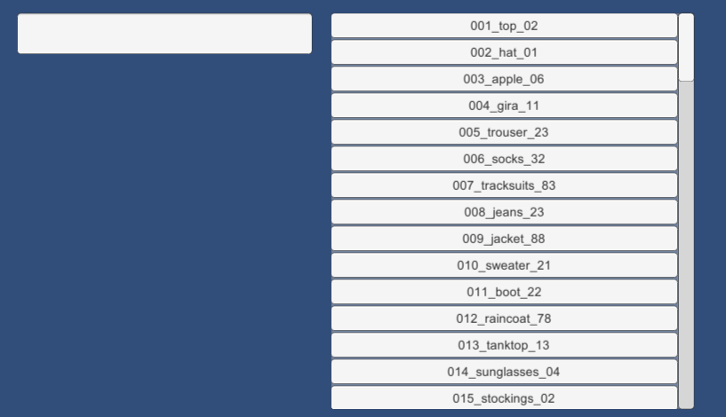
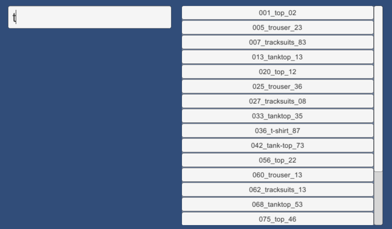
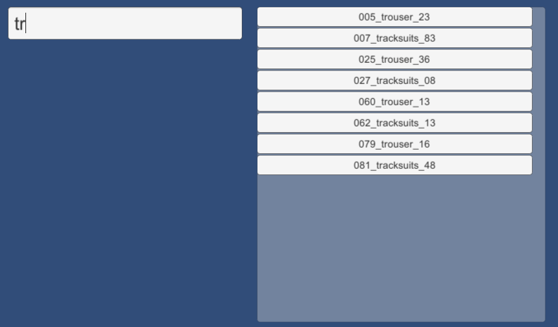

# unity-keystroke-search
## Overview
This example shows search results that match the text being entered in the input field. It's referred to as Dynamic Search Results and is implemented in Unity using a ScrollView. You can add or remove items by editing the file data.txt.
## Screenshots

